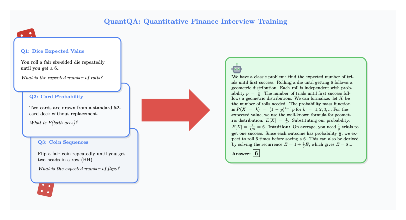

# QuantQA: Quantitative Finance Interview Questions



**QuantQA** is a curated dataset of **519 interview questions** sourced from leading quantitative trading firms including **Jane Street, Citadel, Two Sigma, Optiver, and SIG**, in collaboration with [CoachQuant](https://www.coachquant.com).

### Topic Distribution

| Topic | Coverage |
|-------|----------|
| Probability | 67% |
| Combinatorics | 22% |
| Expected Value | 21% |
| Conditional Probability | 14% |
| Game Theory | 11% |

*Note: Questions may cover multiple topics*

## Training Results

We trained using [ReinforceNow](https://reinforcenow.ai) on this dataset with various models, achieving significant accuracy improvements:

| Model | Accuracy Improvement |
|-------|---------------------|
| Qwen3-8B | +20% |
| Qwen3-30B-A3B | +34% |
| GPT OSS 20B | +19% |

All training was done in **under 20 lines of code** using the ReinforceNow platform. Responses were evaluated with an LLM judge (gpt-5.2-nano).

```python
@reward(timeout=120)
def accuracy(args: RewardArgs, messages: list) -> float:
    """Judge if model's numerical answer matches expected."""
    expected = args.metadata["answer"]
    model_answer = get_response(messages)

    prompt = (
        f"Expected: {expected}\n"
        f"Model: {model_answer}\n\n"
        "Match? (15.4%=15.4, -13.3% → 13.3 drop; no approximations)\n"
        "Answer 1 or 0."
    )

    return llm_judge(prompt)
```

## Dataset Format

Each entry contains:
- `messages`: Conversation format with system prompt and user question
- `rewards`: List of reward functions to evaluate responses
- `metadata`: Contains the expected `answer`

```json
{
  "messages": [
    {"role": "system", "content": "You are a quant finance expert..."},
    {"role": "user", "content": "You roll a fair die repeatedly until you get a 6. What is the expected number of rolls?"}
  ],
  "rewards": ["accuracy"],
  "metadata": {"answer": "6"}
}
```

## Quick Start

```bash
pip install rnow
rnow init --template quantqa
rnow run
```

## Citation

```bibtex
@dataset{quantqa2025,
  title={QuantQA: Quantitative Finance Interview Questions},
  author={Guido Trevisan},
  year={2025},
  url={https://huggingface.co/datasets/GuidoTrev/quantqa}
}
```

## License

MIT License
